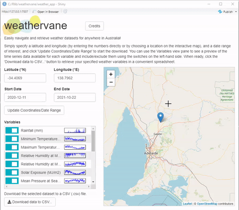
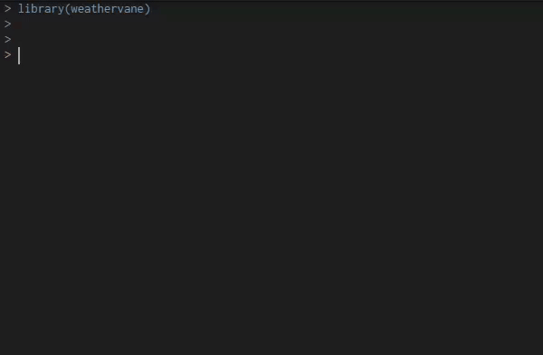

<!-- README.md is generated from README.Rmd. Please edit that file -->

# weathervane

<!-- badges: start -->

[](https://www.repostatus.org/#active)
[](https://choosealicense.com/licenses/mit/)
[](/DESCRIPTION)
[](https://cran.r-project.org/)
[](https://github.com/biometryhub/weathervane/actions)
[](https://app.codecov.io/gh/biometryhub/weathervane?branch=main)
[](https://hits.seeyoufarm.com)
<!-- badges: end -->

Easily navigate and retrieve weather datasets for anywhere in Australia!

The **weathervane** package aids researchers in retrieving Australian
weather and climate data (sourced from
[SILO](https://www.longpaddock.qld.gov.au/silo/) and the [Bureau of
Meteorology](http://www.bom.gov.au/)) to incorporate into statistical
analyses of agronomic experiments,  
plant-breeding trials and other research.

This R package includes a simple and user-friendly Shiny App for
retrieving weather data, complete with an interactive map, data previews
and CSV spreadsheet export.



Alternatively, load the library and use the weather data retrieval
functions directly in your statistical analysis workflow.



# Installation

Run the following code on your R console to install this package:

``` r
if(!require("remotes")) install.packages("remotes") 
remotes::install_github("biometryhub/weathervane", upgrade = FALSE)
```

# Using the package

Load the package and start using it with:

``` r
library(weathervane)
```

## Using the library functions directly

Invoke `get_weather_data` together with a latitude and longitude (in
*decimal degrees* Northing/Easting, respectively), and a start date (as
a Date object or a ‘YYYY-MM-DD’ string). Optionally, specify an end date
too; by default, this function will grab all data up to the most recent
possible date. The function returns the weather data in a neat data
frame.

> **Example:** Here we grab a week’s worth of weather data for the
> Adelaide CBD (-34.9285°N, 138.600°E) from 01/01/2021 to 07/01/2021
> inclusive:
>
> ``` r
> get_weather_data(-34.9285, 138.6007, '2021-01-01', '2021-01-07')
> ```

By default, all possible weather variables are returned. Should you wish
to fine-tune the selection of variables before they are retrieved from
the server, this can be done by specifying the variables individually.
(See `weather_variables` for the variables available and their codes.)

> **Example:** Here we suppose we only want rainfall and maximum
> temperature data for the Sydney CBD (-33.8688°N, 151.2093°E) for the
> first week in June, 2020:
>
> ``` r
> get_weather_data(
>   latitude = -33.8688, 
>   longitude = 151.2093, 
>   start_date = '2020-06-01', 
>   finish_date = '2020-06-07',
>   variables = c('rainfall', 'max_temp')
> )
> ```

## Using the Shiny app

(**Note:** Requires the `shiny`, `ggplot2`, `leaflet` and `R6` packages
to be installed locally for the GUI.)

The Shiny app provides a user-friendly front-end to the **weathervane**
library functions, including an interactive map and variable list, and
easy export to a CSV spreadsheet format. Load the app from the R console
with:

``` r
run_weather_app()
```

# Attribution to SILO/Bureau of Meteorology

The weather datasets currently retrieved by **weathervane** are curated
by [SILO](https://www.longpaddock.qld.gov.au/silo/), who make them
available under a Creative Commons Attribution 4.0 International
Licence. Their data is in turn mostly sourced from the [Australian
Bureau of Meteorology](http://www.bom.gov.au/) and their weather
stations.

Please reference them appropriately in any publications or other
research outputs that use the downloaded weather data. See for example:
- <https://www.longpaddock.qld.gov.au/silo/about/access-data/>

-   <http://www.bom.gov.au/other/copyright.shtml>

# Credits

The **weathervane** package and app were developed by Russell Edson and
Sam Rogers from the University of Adelaide’s Biometry Hub. It is our
hope that the package is useful to Australian researchers in easily
retrieving weather data to incorporate into statistical analyses.

Send all bug reports, questions and comments to
<biometryhubdev@gmail.com>.
